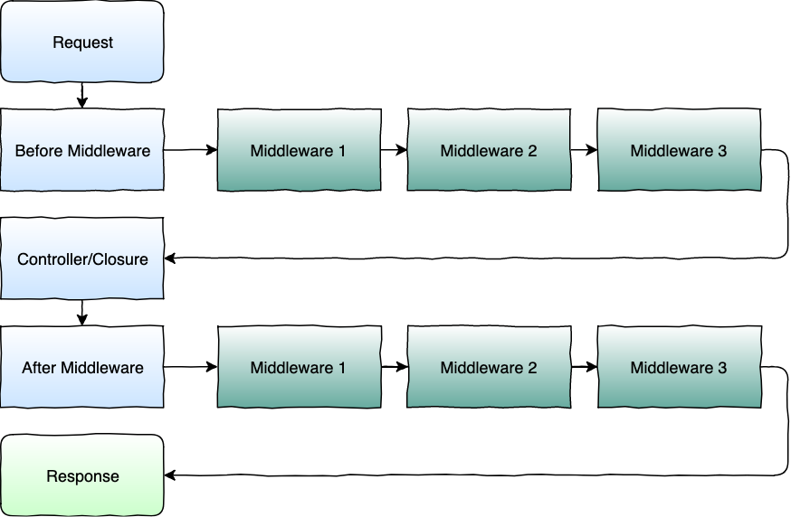

### Forms

#### CSRF Protection

In Laravel 5.7 you create form by simple HTML

```
<form method="POST" action="{{ route('posts.store') }}">

</form>
```

[CSRF](https://en.wikipedia.org/wiki/Cross-site_request_forgery) protection is enabled by default, so you need to include a CSRF token with each form sent

Token can be included by adding a `@csrf` directive inside the `<form>` tag. It would generate an `<input>` of type `hidden` with the token as value

```
<form method="POST" action="{{ route('posts.store') }}">
	@csrf
</form>
```

The token is then verified inside Laravel using the `VerifyCsrfToken` middleware.

### Middleware

Middleware is a mechanism that filter requests going through your application. 

Simply put - each middleware is a chunk of code that runs BEFORE or AFTER the request is handled by `Controller Action` or a `Closure`.



An example AFTER middleware from [Laravel Docs](https://laravel.com/docs/5.7/middleware#defining-middleware)

```
namespace App\Http\Middleware;

use Closure;

class AfterMiddleware
{
	public function handle($request, Closure $next)
	{
		// Calling $next with $request parameter
		$response = $next($request);
		
		// Do something here after the request is handled by Controller/Closure
             
		return $response;
	}
}
```

An example BEFORE middleware

```
namespace App\Http\Middleware;

use Closure;

class BeforeMiddleware
{
	public function handle($request, Closure $next)
	{
		// Do something here before the request is handled by Controller/Closure...
		
		// Calling $next with $request parameter
		return $next($request);
    }
}
```

Middleware should call the passed `Closure` `$next` with the `$request` parameter to allow further processing, or `throw` an `Exception` or do a redirect to stop further processing of the `Request`.

### Request

Obtaining data sent with request

```
class PostController extends Controller
{
    public function store(Request $request)
    {
        $title = $request->input('title');
    }
}
```

Reading all input as an `array`

```
$input = $request->all();
```

Reading an individual value with default provided

```
$name = $request->input('title', 'Draft post');
```

Retrieving all of the input values as an `array`

```
$input = $request->input();
```

The `input()` method can read data regardless of the HTTP verb used (works for `GET` query parameters or input fields sent through `<form>` with `POST` method)

Veryfing if input value is present

```
if ($request->has('title')) {
    // Do something with title
}
```

### Redirects

Redirect to a URL

```
return redirect('/posts');
```

Redirect to a route with "flashed input"

```
return redirect('/posts/create')->withInput();
```

Redirect to last URL with "flashed input"

```
return back()->withInput();
```

Redirect to a named route

```
return redirect()->route('posts.index');
```

Redirect with flash message

```
return redirect()->route('posts')->with('status', 'New post created!');
```

#### Flashing input

Sometimes you need to repopulate the form with the old input, eg. when validation failed and you don't want the user to re-type all the fields.

You can do

```
$request->flash();
```

Or the above example (flash input and redirect)

```
return redirect('form')->withInput();
```